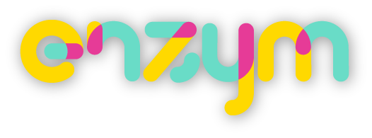

# Enzym smart contracts

## Enzym Token: ZYM

- ERC20 token with some additions: approveAndCall, transferAndCall, increaseApproval and decreaseApproval
- 1000,000,000 tokens

## Live on Ethereum blockchains

### Mainnet

- ZYM: [0xdc53ae3864dbafff56861228bbcd83a026e4fe3e](https://etherscan.io/address/0xdc53ae3864dbafff56861228bbcd83a026e4fe3e)

### Testnet (Kovan)

- ZYM: [0xdc53ae3864dbafff56861228bbcd83a026e4fe3e](https://kovan.etherscan.io/address/0xdc53ae3864dbafff56861228bbcd83a026e4fe3e)